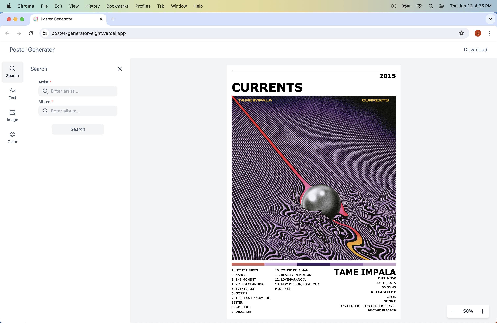

# Poster Generator

A web application built in React, allowing music enthusiasts to design and download album cover posters.

[Live Demo](https://poster-generator-eight.vercel.app/)

## Getting Started

### Prerequisites

Before you can run the project, ensure you have the following installed:

1. Node - https://nodejs.org/en/download/package-manager

2. Yarn - https://yarnpkg.com/getting-started/install

You also need to have a Music Discovery API key. Follow these steps to set it up:

1. Visit https://www.last.fm/api/account/create and register your application to receive an API key.

2. Copy the .env.local.example file to .env.local in the root directory of your project:

        cp .env.local.example .env.local

3. Open the .env.local file and set the NEXT_PUBLIC_API_KEY variable to your newly aquired API key:

        NEXT_PUBLIC_API_KEY=your_last_fm_api_key

### Installing

To clone the repository, run:

    git clone git@github.com:<USERNAME>/poster-generator.git

To install the necessary dependencies, run:

    yarn install
    
### Executing program

To start the development server, run: 

    yarn dev

By default, the app will open in your web browser at [http://localhost:3000](http://localhost:3000)

## Running Tests

### Unit Test

To run the unit tests, run:

    yarn test

### End-to-End Test

To run the end-to-end (E2E) test, run:

    yarn playwright test

